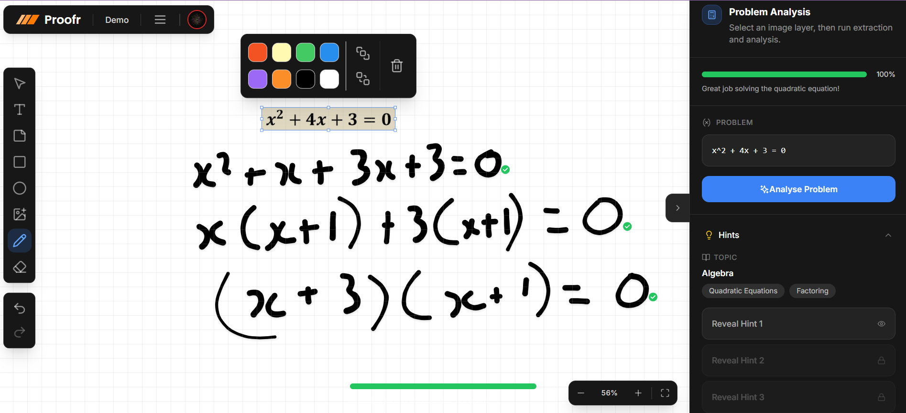

Try It Out: [Live Demo](proofr.vercel.app)



```

### Install packages

```shell
npm i
```

### Setup .env file


```js
CONVEX_DEPLOYMENT=
NEXT_PUBLIC_CONVEX_URL=
NEXT_PUBLIC_CLERK_PUBLISHABLE_KEY=
CLERK_SECRET_KEY=
LIVEBLOCKS_SECRET_KEY=
GROQ_API_KEY=
GEMINI_API_KEY=
```

### Setup Convex

```shell
npx convex dev

```

### Start the app

```shell
npm run dev
```
